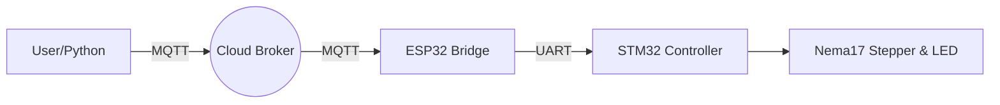

# IoT Motor Control System

This repository contains the complete software solution for the **Robotic Software Engineer Task** at Epicure Robotics.

The system implements a full communication pipeline where a **Python** script on a computer controls a **Stepper Motor** and **LED** connected to an **STM32** microcontroller, bridged wirelessly via an **ESP32** over **MQTT**.

##  Project Overview
**Objective:** Develop a Python-based communication system interfacing between a PC, an ESP microcontroller (via MQTT), and an STM microcontroller (via UART) to control hardware.

### System Architecture
The data flow follows the architecture defined in the task requirements:
1.  **PC (Python):** Captures user commands and publishes to MQTT topic `epicure/commands`.
2.  **ESP32 (Bridge):** Subscribes to MQTT, receives the message, and forwards it via UART (Serial2).
3.  **STM32 (Controller):** Listens on UART, parses the command string, and executes motor/LED control logic.


-----


## Launch Codes

Follow these exact steps to launch the simulation and control the system.

### Step 1:
Ensure your Python environment is ready.

1. Open your Terminal.
 
2. Navigate to the project directory:
   
   ```bash
   cd Epicure_Robotics_Task

3.  Install the required MQTT library:
  
    ```bash
    
    pip3 install paho-mqtt
    
    ```

### Step 2: Start the Hardware Simulation (Wokwi)

Since this is a hybrid simulation, you must start the virtual hardware first.

1.  **Launch ESP32 (The Bridge):**
      * Open your Wokwi project for the **ESP32**.
      * Click the green **Play Button**.
      * *Wait for:* `WiFi connected` and `Attempting MQTT connection...connected`.
2.  **Launch STM32 (The Controller):**
      * Open your Wokwi project for the **STM32**.
      * Click the green **Play Button**.
      * *Wait for:* `STM32 Ready. Waiting for commands...`

### Step 3: Start the Control Software (Python)

1.  In your Terminal, run the control script:
    ```bash
    python3 main.py
    ```
2.  *Success Indicator:* You will see `Connected to MQTT Broker!` followed by `Command >`.


## Implementation & Simulation

Due to hardware constraints, this project utilizes a **Hybrid Simulation Strategy** using [Wokwi](https://wokwi.com). The system was validated in two integrated stages to ensure full functionality without physical wiring.

### 1\. Communication Stack (Python ↔ ESP32)

  * **Tools:** macOS Terminal (Python) + Wokwi ESP32 Simulator (Guest Mode).
  * **Method:** The Python script communicates with the Wokwi Virtual ESP32 over the public `broker.hivemq.com` MQTT broker.
  * **Validation:** Confirmed that strings sent from the local Python script are instantaneously received by the simulated ESP32 and forwarded to the UART buffer


  

### 2\. Control Logic Stack (STM32 ↔ Hardware)

  * **Tools:** Wokwi STM32 Nucleo Simulator + A4988 Driver + Nema 17 Stepper.
  * **Method:** Since Wokwi does not support direct UART connection between separate browser tabs, the "UART Input" was simulated by injecting command strings (`motor:200:1`) directly into the STM32 Serial Monitor.
  * **Validation:** Verified that the STM32 firmware correctly parses the strings and drives the A4988 driver signals to rotate the motor and toggle the LED.


-----

## 📸 Testing & Results

### 1\. Full System Communication Test

*Below: Python running on macOS Terminal (Left) sending `motor:200:1` to the Virtual ESP32 (Right) over the public MQTT broker. The message is successfully received and forwarded.*


https://github.com/user-attachments/assets/3056c8a9-4e64-437c-9807-ef44085254c0


### 2\. STM32 Motor Control Verification

*Below: The STM32 Nucleo receiving the parsed UART command and driving the Nema 17 Stepper Motor via the A4988 Driver.*


https://github.com/user-attachments/assets/dfa3d63f-2113-41b2-9bb1-4e9f937a3803


-----

## Repository Structure

```text
Epicure_Robotics_Task/
├── 1_Python_Control/
│   ├── main.py             
│   └── requirements.txt     
├── 2_ESP32_Firmware/
│   └── esp32_firmware.ino  
├── 3_STM32_Firmware/
│   └── stm32_firmware.ino  
├── assets/                  
└── README.md               
```

-----

## Source Code

main.py

```python
import paho.mqtt.client as mqtt
import time

# Configuration
BROKER = "broker.hivemq.com" 
PORT = 1883
TOPIC = "epicure/commands"

def on_connect(client, userdata, flags, rc):
    if rc == 0:
        print(f"Connected to MQTT Broker: {BROKER}")
    else:
        print(f"Failed to connect, return code {rc}")

def main():
    client = mqtt.Client()
    client.on_connect = on_connect
    
    print("Connecting to network...")
    try:
        client.connect(BROKER, PORT, 60)
        client.loop_start()
    except Exception as e:
        print(f"Connection failed: {e}")
        return

    print("\n--- Epicure Control Terminal ---")
    print("Type commands like 'motor:100:1' or 'led:on'")
    print("Type 'exit' to quit.\n")

    try:
        while True:
            cmd = input("Command > ")
            if cmd == 'exit':
                break
            if cmd.strip():
                client.publish(TOPIC, cmd)
                print(f"Sent: {cmd}")
            
    except KeyboardInterrupt:
        print("\nExiting...")
    finally:
        client.loop_stop()
        client.disconnect()

if __name__ == "__main__":
    main()
```

esp32_firmware.ino

```cpp
#include <WiFi.h>
#include <PubSubClient.h>

// Wokwi Simulation WiFi
const char* ssid = "Wokwi-GUEST"; 
const char* password = "";        

const char* mqtt_server = "broker.hivemq.com"; 
const char* topic = "epicure/commands";

WiFiClient espClient;
PubSubClient client(espClient);

#define RXD2 16
#define TXD2 17

void setup() {
  Serial.begin(115200);
  Serial2.begin(115200, SERIAL_8N1, RXD2, TXD2); 

  setup_wifi();
  client.setServer(mqtt_server, 1883);
  client.setCallback(callback);
}

void setup_wifi() {
  delay(10);
  Serial.println("Connecting to Wokwi-GUEST...");
  WiFi.begin(ssid, password);

  while (WiFi.status() != WL_CONNECTED) {
    delay(500);
    Serial.print(".");
  }
  Serial.println("\nWiFi connected");
}

void callback(char* topic, byte* payload, unsigned int length) {
  String message = "";
  for (int i = 0; i < length; i++) {
    message += (char)payload[i];
  }
  Serial.print("MQTT RECEIVED: ");
  Serial.println(message);
  
  // Forward to STM32
  Serial2.println(message); 
  Serial.println(">> Forwarded to STM32 via UART");
}

void reconnect() {
  while (!client.connected()) {
    Serial.print("Attempting MQTT connection...");
    String clientId = "EpicureClient-";
    clientId += String(random(0xffff), HEX);
    
    if (client.connect(clientId.c_str())) {
      Serial.println("connected");
      client.subscribe(topic);
    } else {
      delay(5000);
    }
  }
}

void loop() {
  if (!client.connected()) reconnect();
  client.loop();
}
```


stm32_firmware.ino


```cpp
// Pin definitions for Nucleo C031C6
#define LED_PIN  D13
#define DIR_PIN  D2
#define STEP_PIN D3

String inputString = "";
bool stringComplete = false;

void setup() {
  pinMode(LED_PIN, OUTPUT);
  pinMode(STEP_PIN, OUTPUT);
  pinMode(DIR_PIN, OUTPUT);
  
  Serial.begin(115200);
  Serial.println("STM32 Ready. Waiting for commands...");
}

void loop() {
  while (Serial.available()) {
    char inChar = (char)Serial.read();
    if (inChar == '\n') {
      stringComplete = true;
    } else {
      inputString += inChar;
    }
  }

  if (stringComplete) {
    parseCommand(inputString);
    inputString = "";
    stringComplete = false;
  }
}

void parseCommand(String cmd) {
  cmd.trim();
  
  if (cmd.startsWith("led:")) {
    if (cmd.indexOf("on") > 0) {
      digitalWrite(LED_PIN, HIGH);
      Serial.println("LED ON");
    } else {
      digitalWrite(LED_PIN, LOW);
      Serial.println("LED OFF");
    }
  }
  else if (cmd.startsWith("motor:")) {
    int firstColon = cmd.indexOf(':');
    int secondColon = cmd.lastIndexOf(':');
    
    if (firstColon > 0) {
       String stepsStr = cmd.substring(firstColon + 1, secondColon);
       int steps = stepsStr.toInt();
       
       Serial.print("Moving Motor: ");
       Serial.println(steps);
       
       digitalWrite(DIR_PIN, HIGH);
       
       for(int i=0; i<steps; i++) {
         digitalWrite(STEP_PIN, HIGH);
         delay(10);
         digitalWrite(STEP_PIN, LOW);
         delay(10);
       }
    }
  }
}
```

-----

## Communication Protocol

The system uses a strict string-based protocol for commands.

| Command Type | Format | Example | Description |
| :--- | :--- | :--- | :--- |
| **Motor Control** | `motor:<steps>:<dir>` | `motor:200:1` | Moves stepper 200 steps in direction 1. |
| **LED Control** | `led:<state>` | `led:on` | Turns the LED High/Low. |

-----

## Author

**[Sriram S Rajan]**
*Submitted for the Robotic Software Engineer Intern Role at Epicure Robotics.*

```
```
